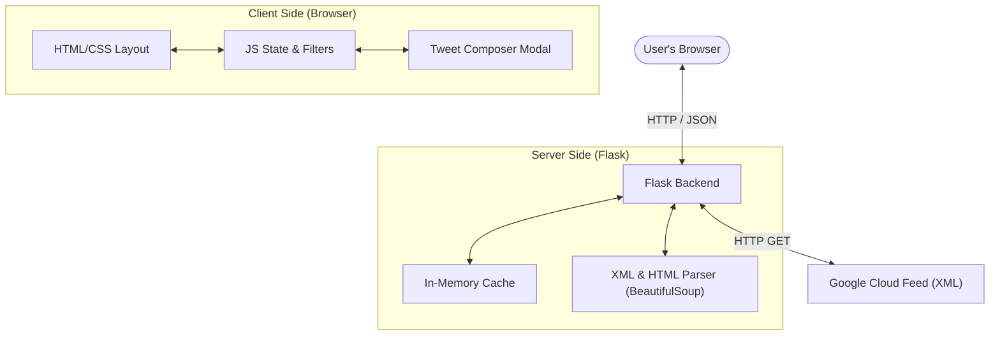
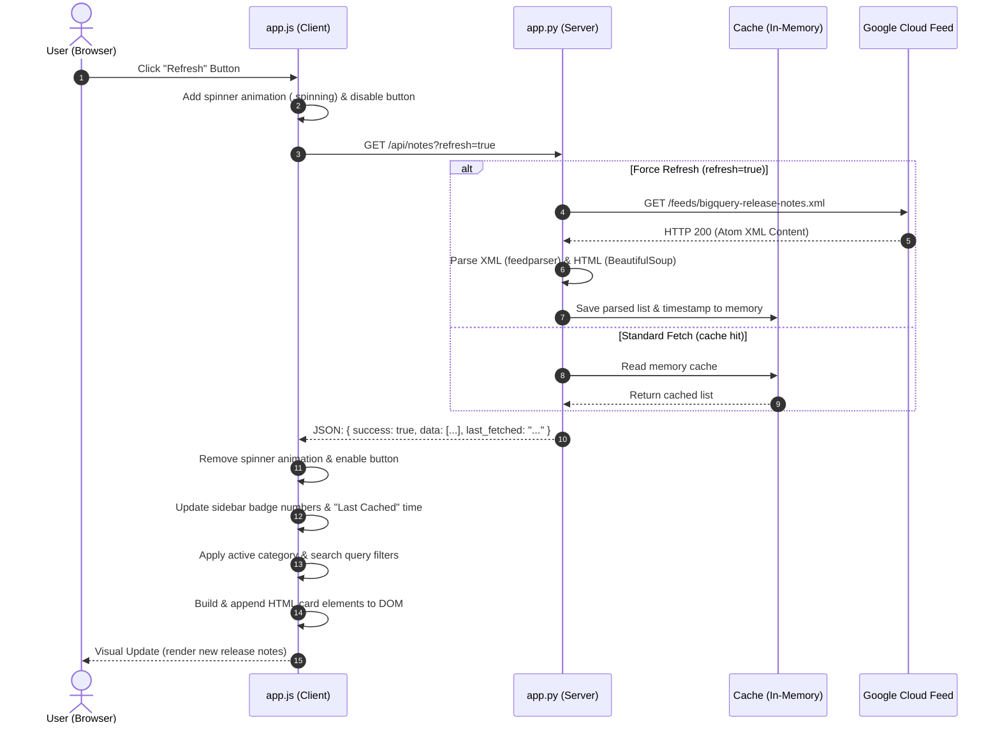

# BigQuery Release Notes Dashboard: Technical Deep Dive

This document provides a detailed breakdown of the architecture, components, and data flow of the BigQuery Release Notes Dashboard.

---

## 1. Key Features
* **Feed Aggregation**: Fetches the official Atom/XML release notes feed directly from Google Cloud.
* **Granular Extraction**: Parses single feed entries (which group a whole day's updates) and splits them into distinct, category-tagged sub-updates (e.g., Features, Announcements, Issues, Deprecations).
* **Smart Server Caching**: Implements a 5-minute memory cache to prevent rate-limiting and ensure fast load times, with a force-refresh capability.
* **Instant Client Filtering & Search**: Client-side filtering by category badges and fuzzy real-time search with visual keyword highlighting.
* **Custom Twitter/X Intent Composer**: Intercepts updates to draft structured, character-counted tweets complete with hashtags, links, and text preview.

---

## 2. System Architecture



### Server-Side (Python/Flask)
The server-side component ([app.py](file:///C:/Users/ADMIN/agy-cli-projects/app.py)) serves as a middleware proxy. Its core duties are:
1. **Routing**: Serves the single-page HTML client on `/` and exposes the `/api/notes` JSON endpoint.
2. **Caching**: Keeps the parsed release notes in memory for 300 seconds (`expiry`). If `refresh=true` is requested, it bypasses the cache and updates it.
3. **Feed Parsing**:
   * Uses `requests` to fetch the XML feed using a custom user-agent header to avoid blocked requests.
   * Feeds the XML body to `feedparser` to extract standard Atom metadata (entry titles, links, publication timestamps, IDs).
   * Passes each entry's HTML summary to `BeautifulSoup` to find `<h3>` elements and isolate individual updates by category.
   * Cleans HTML blocks into plain text for social sharing.

### Client-Side (HTML/CSS/JS)
The frontend uses standard web technologies built for premium aesthetics and performance:
1. **HTML Structure** ([templates/index.html](file:///C:/Users/ADMIN/agy-cli-projects/templates/index.html)): A modern dashboard with a left control sidebar (containing statistics and category filter buttons) and a right-side scrollable content container.
2. **Styling** ([static/css/style.css](file:///C:/Users/ADMIN/agy-cli-projects/static/css/style.css)):
   * **Variables**: Set up custom colors for obsidian-dark background theme, text, badges, and Twitter branding.
   * **Layout**: Fluid CSS grid with responsive media queries for tablets and mobile devices.
   * **Animations**: Card slide-in transitions, pulse effects on alerts, and spin keyframes on loaders.
3. **Behavior** ([static/js/app.js](file:///C:/Users/ADMIN/agy-cli-projects/static/js/app.js)):
   * Tracks application state: `releaseNotes` list, current active filter `currentFilter`, search query `searchQuery`, and `selectedUpdate` object.
   * Coordinates UI updates: filters the state, calculates sidebar badge counts, renders the cards, and attaches listeners for search input, double clicks, and buttons.
   * Drives the tweet composer: constructs drafts, counts characters (enforcing 280-char boundaries), and handles tags or clipboards.

---

## 3. Request-Response Lifecycle (Sample Flow)

Here is a step-by-step trace of what happens when a user clicks the **Refresh** button to update their dashboard.

### Lifecycle Sequence Diagram



### Detailed Trace

#### Step 1: User Action
The user clicks the **Refresh** button. The frontend event listener triggers:
```javascript
refreshBtn.addEventListener('click', () => fetchNotes(true));
```
* **UI Action**: The refresh icon receives the CSS class `.spinning`, which starts a continuous 360-degree rotation. The button is disabled to prevent spamming.

#### Step 2: Fetching
The browser sends an asynchronous HTTP request to:
`http://127.0.0.1:8080/api/notes?refresh=true`

#### Step 3: Server Execution & XML Parsing
The Flask route `/api/notes` catches the request. It extracts `refresh=true` and calls `fetch_and_parse_feed(force_refresh=True)`:
1. Flask bypasses the cache check and executes `requests.get(...)` to pull the feed XML.
2. The XML structure is parsed by `feedparser.parse()`. A typical entry looks like:
   ```xml
   <entry>
     <title>June 17, 2026</title>
     <link href="https://docs.cloud.google.com/bigquery/docs/release-notes#June_17_2026"/>
     <updated>2026-06-17T00:00:00-07:00</updated>
     <summary type="html">&lt;h3&gt;Feature&lt;/h3&gt;&lt;p&gt;You can enable autonomous embedding...&lt;/p&gt;</summary>
   </entry>
   ```
3. Flask initializes a `BeautifulSoup` instance for the HTML summary:
   * It scans the elements sequentially.
   * When it encounters `<h3>Feature</h3>`, it sets `current_type = "Feature"`.
   * It groups all following elements (paragraphs `<p>`, lists `<ul>`, code `<code>`, links `<a>`) into that block's HTML.
   * It runs `clean_text()` to strip the HTML formatting and tags to build a raw string for Twitter.
4. Flask saves the structured payload in the server `cache` dictionary and returns it as a JSON response.

#### Step 4: Client-Side Rendering
1. The JavaScript fetch promise resolves. The spinning animation is removed, and the refresh button is re-enabled.
2. The JS updates the global state `releaseNotes` with the fresh array.
3. `updateStats()` recalculates counts for each category to update the sidebar badges.
4. `renderFeed()` is called:
   * Loop through each day.
   * Filter updates that match active sidebar categories and search keywords.
   * Group remaining updates under a sticky date header.
   * Instantiate card components:
     ```html
     <div class="update-card card-feature" data-id="...">
         <div class="card-header">
             <span class="card-badge badge-feature"><i class="fa-solid fa-star"></i> Feature</span>
             <div class="card-actions"><button class="btn-tweet-action">Tweet Update</button></div>
         </div>
         <div class="card-body"><p>You can enable autonomous embedding...</p></div>
     </div>
     ```
   * Cards are injected into the `#feed-container` element, presenting a clean visual layout to the user.
